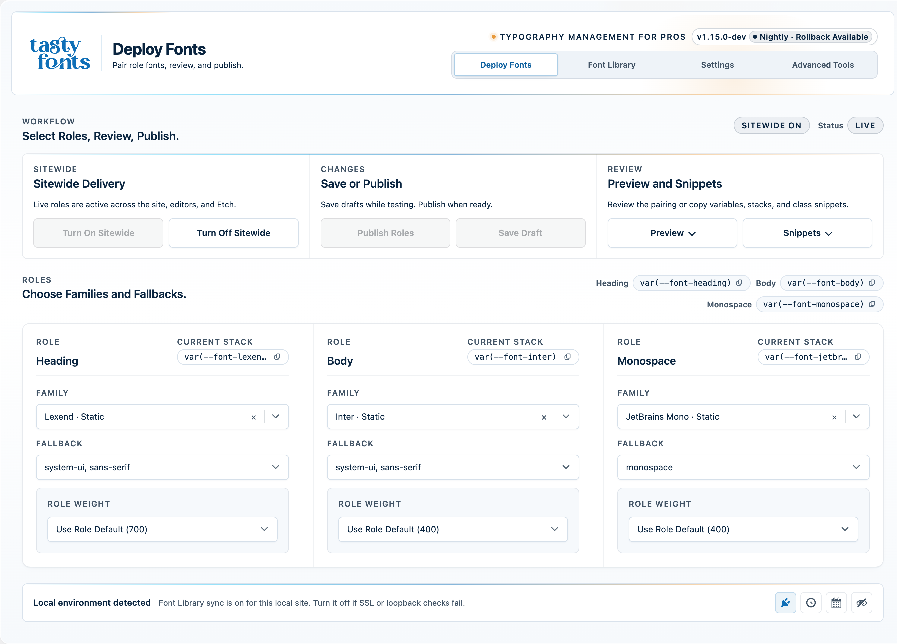
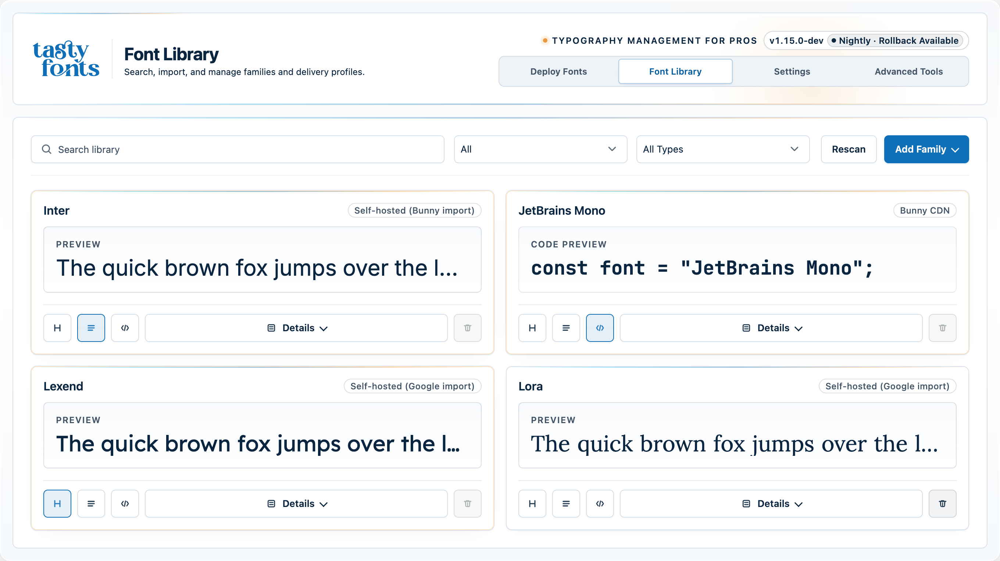
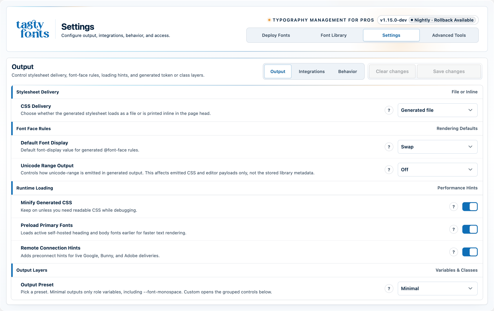
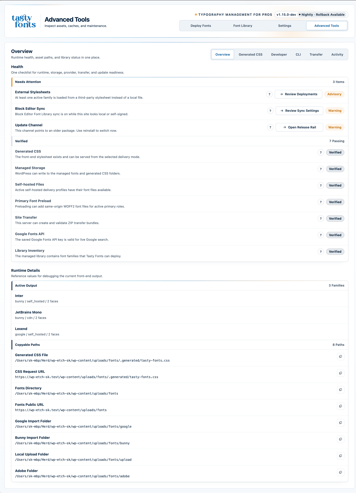

# One Plugin to Manage Every Font on Your WordPress Site

**Tasty Custom Fonts** is the free WordPress font manager from **[Tasty WP](https://github.com/sathyvelukunashegaran)** that unifies local fonts, Google Fonts, Bunny Fonts, and Adobe Fonts in a single dashboard — with a draft-first publishing workflow, GDPR-friendly self-hosting, and deep integrations for Gutenberg and your favourite page builders.

Stop juggling four workflows. Stop breaking Gutenberg presets. Stop rebuilding typography from scratch on every project.


**[⬇ Download free →](https://github.com/sathyvelukunashegaran/Tasty-Custom-Fonts/releases/latest)**

Works with **[EtchWP](https://etch.com) · [Automatic CSS](https://automaticcss.com) · Bricks · Oxygen** — and on any standard WordPress site without them.

---

## The Problem With WordPress Fonts Today

Every WordPress project means the same painful loop: uploading fonts in one plugin, configuring a CDN in another, fixing broken Gutenberg presets in a third, worrying about GDPR violations from remote Google Fonts calls, and rebuilding the whole system when a client changes their typeface. There is no single place to see, control, and safely publish the fonts that shape your site.

Tasty Custom Fonts fixes that — one plugin, every font source, zero build tools.

---

## Why Tasty Custom Fonts

- **Stop rebuilding your font setup from scratch.** One library, one workflow, reusable across every project.
- **See exactly how typography looks before it goes live.** Draft roles let you compare heading, body, and monospace output against the live site before a single visitor sees a change.
- **Stay GDPR-friendly with one-click self-hosting.** Import Google Fonts and Bunny Fonts into your own server — no third-party CDN requests at runtime, no compliance headaches.
- **Switch delivery modes without rebuilding anything.** Each font family stores multiple delivery profiles. Toggle between self-hosted and CDN without touching your CSS or role assignments.
- **Keep every layer of WordPress in sync.** Runtime CSS, Gutenberg font presets, preloads, preconnect hints, and builder outputs all generate from the same settings surface.

---

## Everything You Need, Nothing You Don't

### Add Any Font Source

Pull in fonts from wherever your project needs them — all managed from the same dashboard.

- Upload `WOFF2`, `WOFF`, `TTF`, and `OTF` files directly from the WordPress admin
- Import Google Fonts as self-hosted files or serve from Google CDN
- Import Bunny Fonts as self-hosted files or serve from Bunny CDN
- Connect an Adobe Fonts web project and use Adobe-hosted families alongside local and imported fonts
- Rescan `wp-content/uploads/fonts/` to pick up files added outside the plugin UI

### Preview & Publish Safely

Your live site stays unchanged until you say so.

- Build draft heading, body, and optional monospace roles before applying them sitewide
- Preview typography across editorial, interface, reading, card, and code scenes
- Compare draft versus live output side by side
- Publish the full typography system in one action

### Control How Fonts Are Delivered

Precise runtime control — no manual CSS required.

- Store multiple delivery profiles per family and choose which is active at runtime
- Enable variable font support for axis-aware controls and flexible weight behavior per role
- Generate CSS custom properties, optional utility classes, and `@font-face` rules automatically
- Configure `font-display`, fallback stacks, and unicode-range handling per family
- Emit WOFF2 preloads for self-hosted families and preconnect hints for CDN deliveries

### Sync With Your Whole Stack

Published fonts reach every layer of your WordPress site automatically.

- Register runtime families as Gutenberg font presets
- Optionally sync published families into the core Block Editor Font Library
- Push typography to Etch, Bricks, Oxygen, and Automatic.css through dedicated integrations
- Inspect generated CSS, download the runtime stylesheet, and trace changes through the activity log

---

## See It in Action

> 📸 **Drop your screenshots into the `screenshots/` folder using the filenames below.**

<table>
  <tr>
    <td align="center" width="50%">
      <br/>
      <sub><b>Deploy Fonts</b> — compare draft vs. live before publishing</sub>
    </td>
    <td align="center" width="50%">
      <br/>
      <sub><b>Font Library</b> — all families, delivery profiles, and publish states</sub>
    </td>
  </tr>
  <tr>
    <td align="center" width="50%">
      <br/>
      <sub><b>Settings</b> — output controls, integrations, and runtime behavior</sub>
    </td>
    <td align="center" width="50%">
      <br/>
      <sub><b>Advanced Tools</b> — generated CSS, diagnostics, and activity log</sub>
    </td>
  </tr>
</table>

---

## Supported Font Sources

| Source | Delivery options | Self-hostable | GDPR-friendly |
| --- | --- | --- | --- |
| Local files | Self-hosted | ✅ Yes | ✅ Yes |
| Google Fonts | Self-hosted or Google CDN | ✅ Yes | ✅ Yes (when self-hosted) |
| Bunny Fonts | Self-hosted or Bunny CDN | ✅ Yes | ✅ Yes (when self-hosted) |
| Adobe Fonts | Adobe-hosted | — | ❌ No (Adobe-hosted) |

Each family stores one or more delivery profiles. The active profile controls what the plugin serves at runtime — switch it any time without rebuilding your typography system.

Self-hosted Google Fonts are stored under your uploads directory (typically `wp-content/uploads/fonts/google/<family-slug>/`).  
Self-hosted Bunny Fonts are stored under your uploads directory (typically `wp-content/uploads/fonts/bunny/<family-slug>/`).

---

## How It Works — 5 Steps

1. **Add fonts to your library** — local files, Google Fonts, Bunny Fonts, or Adobe Fonts, all from the same screen.
2. **Choose a delivery profile** for each family — self-hosted for full GDPR control, CDN for convenience.
3. **Assign draft roles** for heading, body, and optional monospace output — nothing goes live yet.
4. **Preview the full typography system** and compare it against what is currently live on the site.
5. **Publish sitewide** — the frontend, Gutenberg, and your page builder all update in one step.

No build tools. No CDN accounts. No custom code.

---

## Built for the Tools You Already Use

All integrations are opt-in and activate automatically when the companion tool is present. Tasty Custom Fonts works on any standard WordPress install without requiring any of them.

- **Gutenberg** — published families register as editor font presets and optionally sync into the core Block Editor Font Library
- **Etch** — runtime stylesheet URLs and bridge CSS pass through the canvas bridge so preview typography stays aligned with the live site
- **Automatic.css** — heading and body font-family and font-weight settings sync automatically with your managed role variables
- **Bricks** — published families appear in Bricks builder selectors; matching Bricks typography choices mirror into Gutenberg editor styles
- **Oxygen** — published families surface through the compatibility shim; matching Oxygen choices mirror into Gutenberg editor styles

---

## No Lock-In. No Bloat.

Tasty Custom Fonts has zero PHP dependencies. There is no Composer install, no npm install, and no build step — ever.

Output is plain CSS and standard WordPress enqueues. Nothing proprietary, nothing that breaks if you deactivate the plugin.

Developers can filter the generated CSS, modify the font catalog, and hook into delivery behavior using standard WordPress filters:

```php
// Modify the generated runtime CSS
add_filter( 'tasty_fonts_generated_css', function( $css, $catalog, $roles, $settings ) {
    return $css;
}, 10, 4 );
```

The plugin is translation-ready and uses the `tasty-fonts` text domain. Translation template at `languages/tasty-fonts.pot`.

---

## Requirements

| Component | Minimum |
| --- | --- |
| WordPress | 6.5 |
| PHP | 8.1 |
| Etch / Bricks / Oxygen / Automatic.css | Optional |

---

## Install

### Fastest Path — Download Free From GitHub Releases

1. Download the latest ZIP from **[GitHub Releases](https://github.com/sathyvelukunashegaran/Tasty-Custom-Fonts/releases/latest)**.
2. In WordPress, go to `Plugins → Add New Plugin → Upload Plugin`.
3. Upload the ZIP and activate **Tasty Custom Fonts**.
4. Open **Tasty Fonts** in the WordPress admin menu.

No npm install. No Composer. No build step.

The packaged plugin directory is `tasty-fonts/`. Once installed from a release ZIP, you can follow the `Stable`, `Beta`, or `Nightly` update channel from `Settings → Behavior → Update Channel` — updates deliver automatically through the WordPress admin.

### Manual / Git Install

1. Clone or download this repository.
2. Copy the `tasty-fonts` folder into `wp-content/plugins/`.
3. Activate the plugin from the WordPress **Plugins** screen.
4. Open **Tasty Fonts** in the WordPress admin menu.

---

## Frequently Asked Questions

<details>
<summary><strong>Do I need Etch, Bricks, or another page builder?</strong></summary>

No. Tasty Custom Fonts works on any standard WordPress site without any companion plugins. Etch, Automatic.css, Bricks, and Oxygen integrations are opt-in and only activate when those tools are already installed.

</details>

<details>
<summary><strong>Is this plugin GDPR compliant? Can I self-host Google Fonts?</strong></summary>

Yes. Google Fonts and Bunny Fonts can both be imported into your own server storage. The plugin downloads the font files to `wp-content/uploads/fonts/` and generates `@font-face` rules that point to your own domain — no calls to Google or Bunny servers happen at runtime when you use self-hosted mode.

</details>

<details>
<summary><strong>How do I self-host Google Fonts in WordPress using this plugin?</strong></summary>

Search for a Google Fonts family inside the Font Library, choose **Self-hosted** as the delivery mode, and import. The plugin downloads the font files to `wp-content/uploads/fonts/google/<family-slug>/` and generates the runtime CSS automatically. A valid Google Fonts API key is required to browse/search and import Google Fonts from inside the dashboard, but once imported in **Self-hosted** mode the fonts are served from your own site with no calls to Google at runtime.

</details>

<details>
<summary><strong>Does a Google Fonts API key cost money?</strong></summary>

No. A Google Fonts API key is free. It is only needed if you want live Google Fonts search inside the dashboard. Local uploads, self-hosted imports, Bunny Fonts, and Adobe Fonts workflows do not require a key at all.

</details>

<details>
<summary><strong>Does Tasty Custom Fonts work with Bricks Builder?</strong></summary>

Yes. The Bricks integration exposes published families in Bricks builder selectors and mirrors matching Bricks typography choices into Gutenberg editor styles. It activates automatically when Bricks is installed — no extra configuration needed.

</details>

<details>
<summary><strong>Can I use variable fonts in WordPress with this plugin?</strong></summary>

Yes. Enable variable font support from `Settings → Behavior → Enable Variable Fonts`. Once active, axis-aware controls unlock per role and the plugin tracks weight behavior for variable families correctly.

</details>

<details>
<summary><strong>Does it support WordPress multisite?</strong></summary>

The plugin supports per-site activation inside a multisite network. Network-wide activation is not supported because font assets and settings are stored and generated per site.

</details>

<details>
<summary><strong>Where are font files stored?</strong></summary>

All generated assets and imported files live under `wp-content/uploads/fonts/`, with provider-specific subdirectories for Google (`/google/`) and Bunny (`/bunny/`) imports. The runtime CSS file is written to `wp-content/uploads/fonts/.generated/tasty-fonts.css`.

</details>

---

## What Tasty WP Is Actively Building

The 2.0.0 stable release locks in the current foundation. Here is what comes next:

- 🛠 **WP-CLI commands** for maintenance, cache management, CSS regeneration, rescans, and diagnostics — for agencies and power users who live in the terminal
- 📦 **Portable export/import** — move settings and library metadata between sites securely with a single bundle
- ⚡ **Bulk management for large libraries** — faster browsing, bulk actions, and broader search flows for high-volume workflows

Have a workflow you want prioritized? Open a feature request on **[GitHub Issues](https://github.com/sathyvelukunashegaran/Tasty-Custom-Fonts/issues)** — real-world agency, client, and editorial use cases shape the roadmap directly.

---

## Documentation

Full documentation on the **[GitHub Wiki](https://github.com/sathyvelukunashegaran/Tasty-Custom-Fonts/wiki)**:

| Guide | What's inside |
| --- | --- |
| [Documentation Hub](https://github.com/sathyvelukunashegaran/Tasty-Custom-Fonts/wiki) | Start here — overview and full navigation |
| [Getting Started](https://github.com/sathyvelukunashegaran/Tasty-Custom-Fonts/wiki/Getting-Started) | Installation, first run, and initial setup |
| [Deploy Fonts](https://github.com/sathyvelukunashegaran/Tasty-Custom-Fonts/wiki/Deploy-Fonts) | Draft roles, preview, and publishing workflow |
| [Font Library](https://github.com/sathyvelukunashegaran/Tasty-Custom-Fonts/wiki/Font-Library) | Managing families, delivery profiles, and font-display |
| [Settings](https://github.com/sathyvelukunashegaran/Tasty-Custom-Fonts/wiki/Settings) | Output controls, integrations, and runtime behavior |
| [Advanced Tools](https://github.com/sathyvelukunashegaran/Tasty-Custom-Fonts/wiki/Advanced-Tools) | Generated CSS, diagnostics, and activity log |
| [Developer Docs](https://github.com/sathyvelukunashegaran/Tasty-Custom-Fonts/wiki/Architecture) | Architecture, filters, and extension points |
| [FAQ](https://github.com/sathyvelukunashegaran/Tasty-Custom-Fonts/wiki/FAQ) | Common questions and edge cases |
| [Glossary](https://github.com/sathyvelukunashegaran/Tasty-Custom-Fonts/wiki/Glossary) | Definitions for delivery profiles, roles, and more |

---

## Development

There is no build step, no Composer install, and no npm install.

```bash
php tests/run.php
node --test tests/js/*.test.cjs
find . -name '*.php' -not -path './output/*' -print0 | xargs -0 -n1 php -l
```

AI is used in this repository only to help generate test cases and documentation. Plugin code, architecture, and release behavior are authored and reviewed manually by [Tasty WP](https://github.com/sathyvelukunashegaran).

---

## Contributing

Contribution setup, verification commands, branch expectations, and good-first entry points live in [CONTRIBUTING.md](CONTRIBUTING.md).

For larger changes, open an issue first so the direction is clear before implementation starts. Feature ideas, workflow requests, and usability feedback are welcome through [GitHub Issues](https://github.com/sathyvelukunashegaran/Tasty-Custom-Fonts/issues).

## License

Tasty Custom Fonts is free and open-source software, licensed under the [GNU General Public License v2 or later](LICENSE).
